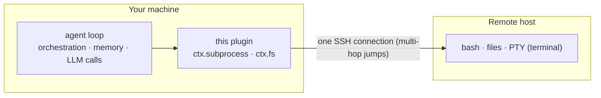

# dsh-workspace-enhancement

English | [中文](README.zh.md)

   

**A DeepSeek Harness workspace-enhancement plugin** — local and remote (SSH) workspaces managed in one place. A session can hold **multiple workspaces** (a main cwd plus a thin declaration list of side directories); machines, TOFU host keys and keychain passwords all live in your local `~/.dsh`. Built on [ssh2](https://github.com/mscdex/ssh2).

## Features

| Feature | Description |
|---|---|
| Remote workspaces | One SSH chain (multi-hop) runs bash / files / PTY / directory browsing. Tools that already use `ctx.subprocess` / `ctx.fs` keep working remotely with no code changes |
| Multi-workspace sessions | The「⊕ 工作区」button in the session header attaches extra directories (local or remote) as a declaration list — mount/unmount + label. The model is told about them and can operate them directly |
| Add-workspace flow | Connection sidebar (saved machines, `~/.ssh/config` aliases, local) + directory browser (breadcrumbs, native chooser, new folder); remote "Connect & open" creates the session on the server |
| Machine settings page | Machine CRUD / test / set-current / forget host key; OS-keychain passwords; TOFU host keys (`accept-new` default) |
| Session awareness | Remote marker + online tri-state + reconnect in the sidebar; the session prompt states the remote / extra-workspace context |
| Cross-server execution | `sw_exec(server, command)` runs a command on a **named registered machine** (defaults to the session's machine). The target OS is probed once per connection (`bash -c` on POSIX, `pwsh -Command` on win32). Windows hosts inject a `bash` tool only for remote-Linux workspace sessions |
| Remote approval gate | Optional per-machine gate (**default off**): every shell-shaped remote command and every remote terminal asks before it runs — `human` asks you each time, `ai` auto-grants a short read-only whitelist (`pwd`, `ls`, `git status`, …) and asks for the rest |
| Model tools | `sw_status`, `sw_connect` (attach this session to machines you already registered), `sw_exec` |
| Runtime localization | UI copy, tool descriptions/errors, and routing errors follow the settings-page **Language** option (`zh`/`en`); the UI defaults to the browser language. Protocol-layer `bad-request:` diagnostics stay English |

## How it works



No DSH install on the remote: the model orchestrates locally, commands run remotely, results come back into context.

How routing, the approval gate, the remote sandbox fence, and session connections actually work: [docs/architecture.md](./docs/architecture.md). Known security boundaries: [SECURITY.md](./SECURITY.md).

## Install

```sh
# from npm (v0.1.0+)
dsh plugin --profile web add dsh-workspace-enhancement
# from source: npm run build first (host loads lib/)
dsh plugin --profile web add <this-repo-path>
```

> **First install with DSH's supply-chain pnpm**: native build scripts are blocked by default —
> allow them once per profile in `pnpm-workspace.yaml` (unstrict `allowBuilds`):
> `ssh2`, `cpu-features`, `koffi`, `node-pty`, `dsh-subprocess-local` — then run
> `dsh plugin --profile web install`. Without it the first `add` exits non-zero
> (`ERR_PNPM_IGNORED_BUILDS`) and the bundle is not appended.

## Compatibility

Which plugin version to install depends on the **DSH host family** you run — check it with `dsh --version`
(and the family under your DSH install, e.g. `<npm root -g>/@deepseek-ai/`):

| Your DSH host | Install | Notes |
|---|---|---|
| **`0.1.5` line** (`0.1.5-rc.1`, `0.1.5-rc.2`, …) | **0.1.4 or newer** | The **only** supported family (peers are `^0.1.5-rc.1`). The browser channel rides the official shared `/api` transport (`/api/dsw/<endpoint>`), so no standalone `/dsw` route is needed |
| `0.1.2-rc.1` family (`0.1.2`, `0.1.3` releases) | `0.1.3` — the last release of that line | **No longer supported** (retired 2026-09-11). That line moved the Connection seam — `connection.rpc.handle` can no longer register a channel — so no fix is backported to it |
| any other / older line | — | Never supported |

**Host and plugin must move together.** The 0.1.4 line speaks `/api/dsw/*` while 0.1.3 and earlier speak
`/dsw/*`, and 0.1.3 has no `readByteRange`. Mixing them leaves the connection / directory UI without a data
channel (the host still boots, the UI silently cannot load machines or browse). Upgrading DSH means upgrading
this plugin in the same step; the full window and the upstream drift log are in
[docs/compatibility.md](./docs/compatibility.md).

## Roadmap

Public progress: [docs/ROADMAP.md](./docs/ROADMAP.md). The single backlog is [docs/backlog.md](./docs/backlog.md).

## Development

Start with [AGENTS.md](./AGENTS.md) (rules, commands, red lines). The document map — what lives where, and what must not be copied — is [docs/README.md](./docs/README.md).

One gate for everything: `npm run check` (static constraints + typecheck + unit tests + build + pack smoke) —
the same command CI runs.

## References

- [dsh-ssh](https://github.com/UynajGI/dsh-ssh): remote execution engine — `ctx.subprocess` / `ctx.fs` providers, jump chains, PTY, directory-picker seam, `session.route` placeholder.
- [dsh-remote](https://github.com/flymysql/dsh-remote): workspace helper — machines registry, TOFU, OS keychain, web UI and settings page.

## License

MIT
