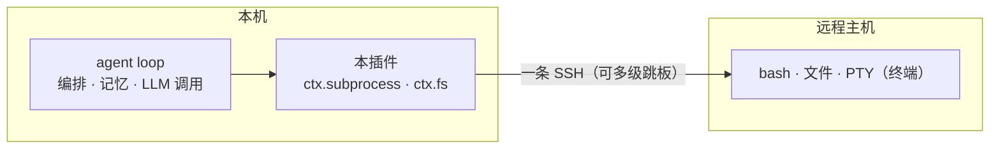

# dsh-workspace-enhancement

[English](README.md) | 中文

   

**一个 DeepSeek Harness 工作区增强插件**：把本地和远程（SSH）工作区放到一个包里统一管理。一个会话可以挂**多个工作区**（主工作区 + 副目录声明清单）；机器、TOFU 指纹与钥匙串都存在你本机的 `~/.dsh` 下。底层用 [ssh2](https://github.com/mscdex/ssh2)。

## 功能

| 功能     | 说明 |
| ------ | ------ |
| 远程工作区 | 一条 SSH（可多级跳板）跑 bash / 文件 / PTY / 目录浏览。已经走 `ctx.subprocess` / `ctx.fs` 的工具不用改就能在远端跑 |
| 多工作区会话 | 会话标题栏「⊕ 工作区」按钮：把额外目录（本地或远程）挂成声明清单——挂/卸 + 显示名。模型能看到清单并直接操作 |
| 添加工作区流程 | 连接侧栏（已保存机器、`~/.ssh/config` 别名、本机）+ 目录浏览器（面包屑、系统选择器、新建文件夹）；远程「连接并打开」直接在服务器上建会话 |
| 机器设置页 | 机器增删改 / 测试 / 设当前 / 忘指纹；OS 钥匙串存密码；TOFU 主机指纹（默认 accept-new） |
| 会话感知 | 会话栏远程标识 + 未知/活跃/离线三态 + 重连；每会话提示里写明远程 / 副工作区上下文 |
| 跨服务器执行 | `sw_exec(server, command)` 在**已注册的指定机器**上执行命令（缺省=当前会话机器）。目标 OS 每次连接探测一次（POSIX 跑 `bash -c`，win32 跑 `pwsh -Command`）。win32 宿主只在远程 Linux 工作区会话注入 `bash` 工具 |
| 远程命令审批门 | 可选的逐机器审批门（**默认关闭**）：每条 shell 形状的远程命令与每个远程终端在执行前先问——`human` 每条都问人，`ai` 对只读白名单（`pwd`、`ls`、`git status` 等）自动放行、其余问人 |
| 模型工具 | `sw_status`、`sw_connect`（把本会话接到你已经注册的机器）、`sw_exec` |
| 运行时国际化 | UI 文案、工具描述/错误与路由错误跟随设置页 **Language** 选项（zh/en）；UI 默认跟随浏览器语言。仅协议层 `bad-request:` 诊断保留英文 |

## 工作原理



远程不用装 DSH：模型在本地编排，命令在远程跑，结果再回本地进上下文。

路由、审批门、远端围栏、会话连接怎么接：见 [docs/architecture.md](./docs/architecture.md)。已知安全边界：见 [SECURITY.md](./SECURITY.md)。

## 安装

```sh
# 从 npm 安装（v0.1.0+）
dsh plugin --profile web add dsh-workspace-enhancement
# 源码安装：先 npm run build（宿主加载 lib/）
dsh plugin --profile web add <本仓库路径>
```

> **DSH 供应链 pnpm 首次安装须知**：原生构建脚本默认被拦截。先在 profile 的
> `pnpm-workspace.yaml`（非严格 `allowBuilds`）放行 `ssh2`、`cpu-features`、`koffi`、
> `node-pty`、`dsh-subprocess-local`，再执行 `dsh plugin --profile web install`；
> 否则首次 `add` 会以非 0 退出（`ERR_PNPM_IGNORED_BUILDS`）且 bundle 不会被追加。

## 版本兼容

装哪个版本的插件，取决于你跑的 **DSH 宿主家族**——用 `dsh --version` 查看（家族版本可看
DSH 安装目录下的 `@deepseek-ai/`，如 `<npm root -g>/@deepseek-ai/`）：

| 你的 DSH 宿主 | 该装哪个版本 | 说明 |
|---|---|---|
| **`0.1.5` 线**（`0.1.5-rc.1`、`0.1.5-rc.2`…） | **0.1.4 或更新** | **唯一**受支持的家族（peer 收窄为 `^0.1.5-rc.1`）。浏览器通道挂官方共享 `/api`（`/api/dsw/<端点>`），不再自挂 `/dsw` |
| `0.1.2-rc.1` 家族（`0.1.2`、`0.1.3` 发布物） | `0.1.3`——该线的最后一个版本 | **已停止支持**（2026-09-11 退场）。该线挪动了 Connection 接缝（`connection.rpc.handle` 已无法注册通道），不会再回填修复 |
| 其它 / 更老的线 | — | 从未支持 |

**宿主与插件必须同步升级。** 0.1.4 线说 `/api/dsw/*`，0.1.3 及更早说 `/dsw/*`，且 0.1.3 没有
`readByteRange`：混用会让宿主起得来、但连接/目录 UI **静默拿不到数据**（机器列表读不出、目录浏览报错）。
支持窗口与上游漂移记录见 [docs/compatibility.md](./docs/compatibility.md)。

## 路线图

公开进度：见 [docs/ROADMAP.md](./docs/ROADMAP.md)。唯一待办真相源是
[docs/backlog.md](./docs/backlog.md)。

## 开发

先读 [AGENTS.md](./AGENTS.md)（规则、命令、红线）。文档地图——什么在哪、什么不要抄——见
[docs/README.md](./docs/README.md)。

统一质量门：`npm run check`（静态闸门 + typecheck + 单测 + build + pack 冒烟）——CI 跑的就是这一条。

## 参考项目

- [dsh-ssh](https://github.com/UynajGI/dsh-ssh)：远程执行引擎（`ctx.subprocess` / `ctx.fs` provider、跳板链、PTY、directory-picker 接缝、`session.route` 占位）。
- [dsh-remote](https://github.com/flymysql/dsh-remote)：工作区助手（machines 注册表、TOFU、OS 钥匙串、Web UI 与设置页）。

## License

MIT
